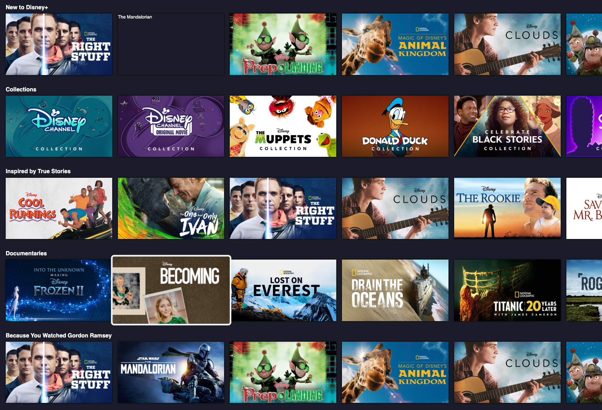

# Disney Takehome Assignment

Demo application to recreate a Disney+ home page.

https://petahbred.github.io/disney-takehome/



## Features

- Side scrolling shelf of media.
- Keyboard Navigation up/down/left/right/enter/back/etc.
- Interaction and selection of a tile.
- VideoArt usage when selecting a tile.

## Development

```
npm install
npm run dev
```

## Build

```
npm install
npm run build
```

## Deployment

## App Architecture and Thought Process

Being familiar with the component based frameworks and libraries such as Vue and React, I wanted to follow a similar vein with my implementation. Each component has a render function with its initial template inside, model, and controller logic.

## Areas of Improvement

### Unit Tests

- Currently there are no unit tests. If given more time, I would follow Test-Driven development to increase app reliability and reduce technical debt.

### End to End Testing

- End to end testing would help test any UI/UX flows and DOM regressions. I would employ the use of Cypress for its fast execution, DOM friendly syntax, and debugging tools.

### Dynamic population

- If given more time, I would have like to implement more dynamic loading. Loading all the content at the beginning of the app can be less performant and jarring for the user. This might brew frustration if the user has to wait to interact with the application or the layout changes out from under them. If I were to implement dynamic loading, I would use the `IntersectionObserver` with a negative `rootMargin` to add a threshold to load before the user can scroll/navigate there.

### Keyboard Navigation

- Currently keyboard navigation does not continue to the next visible item when moving row to row. Instead it keeps the column number and moves the next selected row to that item. It would be ideal and less jarring if the selection continued visually rather than programtically.

- Wrap around should be improved to allow the user to maintain the current viewport and not scrolled all the way to the beginning of the row.

### Animations

- Given more time I would have loved to add more animations and visual appeal to the application to really give it more magic. Some areas that could use animation include, the first paint or selecting a tile.

### Image Error Handling

- Would be nice to have more error handling and fallbacks for images that are slow or fail to load.

### Documentation

- Implementing JSDocs would further improve readability and onboarding. It will also help others figure out the intent of the code.

### Image Logo Handling

- Currently the images received have a black background. I used CSS `mix-blend-mode` and `filter` to make the images transparent.
